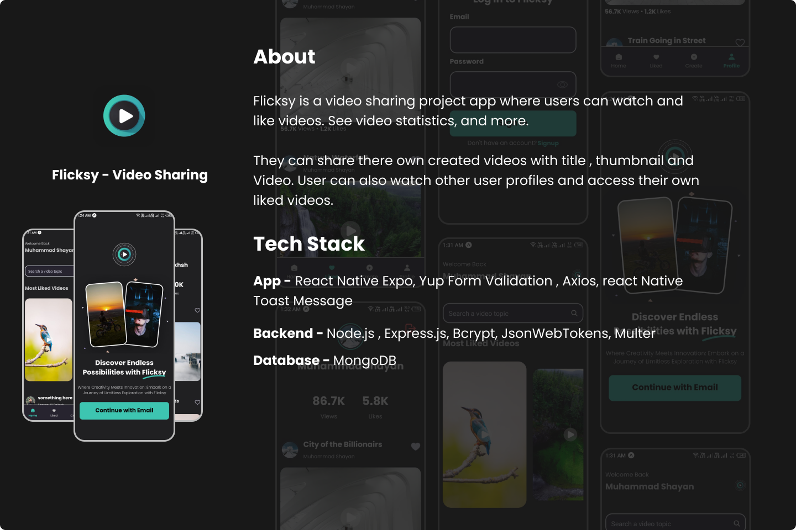
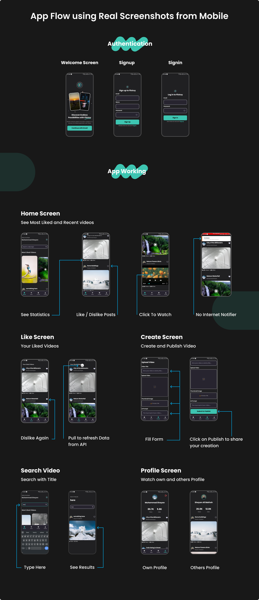

<!-- TABLE OF CONTENTS -->

# 📗 Table of Contents

- [📖 About the Project](#about-project)
  - [🛠 Built With](#built-with)
    - [Tech Stack](#tech-stack)
    - [Key Features](#key-features)
- [👥 Authors](#authors)
- [🤝 Contributing](#contributing)
- [⭐️ Show your support](#support)

<!-- PROJECT DESCRIPTION -->

# 📖 [Flicksy] 

### Flicksy : Flicksy is a video sharing project app where users can watch and like videos. See video statistics, and more.

### They can share there own created videos with title , thumbnail and Video. User can also watch other user profiles and access their own liked videos. 

## 🛠 Built With 

- React Native Expo - Yup Form Validation - Node.js - Express.js - MongoDB - JsonWebTokens

### Tech Stack 

  <ul>
    <li>React Native Expo</li>
    <li>Yup Form Validation</li>
    <li>Node.js</li>
    <li>Express.js</li>
    <li>MongoDB</li>
    <li>JsonWebTokens</li>
  </ul>

<!-- Features -->

### Key Features 

- **[Watch Videos]**
- **[Interact with other videos and se profiles]**
- **[Share your own videos]**
- **[Secure and Cross Platform app]**

(<a href="#readme-top">back to top</a>)

<!-- AUTHORS -->

## 👥 Authors 

👤 Shayan

- GitHub: [@githubhandle](https://github.com/shayan1234554321)
- Twitter: [@twitterhandle](https://twitter.com/shayan123455432)
- LinkedIn: [LinkedIn](https://www.linkedin.com/in/shayan-khan20/)

(<a href="#readme-top">back to top</a>)

<!-- CONTRIBUTING -->

## 🤝 Contributing 

You can contribute to this project by writing an issue <a href="https://github.com/shayan1234554321/flicksy/issues" >here</a>

(<a href="#readme-top">back to top</a>)

<!-- SUPPORT -->

## ⭐️ Show your support 

If you like this project please leave a ⭐️

(<a href="#readme-top">back to top</a>)
